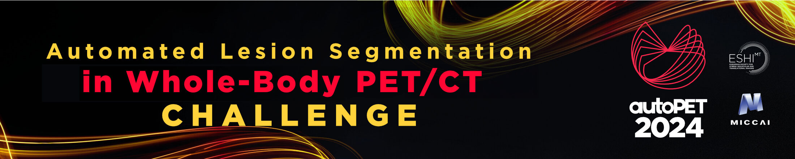

# autoPETIII challenge (becquerel's version)

CHB's solution for the autoPETIII challenge

If you use the data associated to this challenge, please cite: <br/>
<a href="https://doi.org/10.7937/gkr0-xv29"></a>

```
Gatidis S, Kuestner T. A whole-body FDG-PET/CT dataset with manually annotated tumor lesions (FDG-PET-CT-Lesions) 
[Dataset]. The Cancer Imaging Archive, 2022. DOI: 10.7937/gkr0-xv29
```

and
<br/>
COMING SOON

```
COMING SOON
```

## nnunet-baseline
Built from the baseline nnUNet inference algorithm, we added our own models and strategy for PET segmentation.

## evaluation-metrics
Evaluation code for the autoPETIII challenge according to [here](https://autopet-iii.grand-challenge.org/evaluation-and-ranking/)

## References
Challenge: [](https://doi.org/10.5281/zenodo.10990932)<br/>
FDG Database: <a href="https://doi.org/10.7937/gkr0-xv29"></a> <br/>
PSMA Database: COMMING SOON


